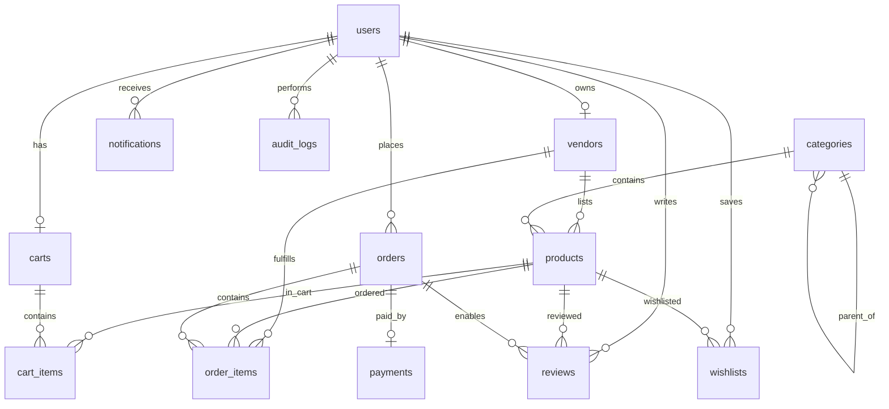

# Data Model: Merkato-pro E-Commerce Platform

**Date**: 2026-05-17 | **Branch**: `001-ecommerce-platform`

## Conventions

- All tables use UUID primary keys via `gen_random_uuid()`
- All tables have `created_at TIMESTAMPTZ DEFAULT now()` and `updated_at TIMESTAMPTZ DEFAULT now()`
- Soft-deletable entities have `deleted_at TIMESTAMPTZ NULL`
- RLS is enabled on all tables
- JSONB is used for flexible/variant data
- All foreign key columns are indexed

---

## Entity: users

Extends Supabase Auth's `auth.users`. This is a public profile table.

| Column | Type | Constraints | Description |
|--------|------|-------------|-------------|
| id | UUID | PK, FK → auth.users.id | Supabase Auth user ID |
| email | TEXT | UNIQUE, NOT NULL | User email |
| phone | TEXT | UNIQUE, NULL | Phone number |
| full_name | TEXT | NOT NULL | Display name |
| avatar_url | TEXT | NULL | Profile photo URL |
| role | TEXT | NOT NULL, CHECK (customer, vendor, delivery_agent, admin) | User role |
| is_verified | BOOLEAN | DEFAULT false | Email/phone verification status |
| locale | TEXT | DEFAULT 'en' | Preferred language (en, am) |
| created_at | TIMESTAMPTZ | DEFAULT now() | |
| updated_at | TIMESTAMPTZ | DEFAULT now() | |

**RLS Policies**:
- Users can read their own profile
- Users can update their own profile (except role)
- Admins can read/update all profiles
- Public can read basic profile info (name, avatar) for reviews

**Indexes**: `role`, `email`, `phone`

---

## Entity: vendors

| Column | Type | Constraints | Description |
|--------|------|-------------|-------------|
| id | UUID | PK, DEFAULT gen_random_uuid() | |
| user_id | UUID | FK → users.id, UNIQUE, NOT NULL | Owner user |
| store_name | TEXT | NOT NULL | Vendor store name |
| store_slug | TEXT | UNIQUE, NOT NULL | URL-friendly store identifier |
| description | TEXT | NULL | Store description |
| logo_url | TEXT | NULL | Store logo |
| banner_url | TEXT | NULL | Store banner image |
| approval_status | TEXT | NOT NULL, CHECK (pending, approved, rejected, suspended) | |
| commission_rate | DECIMAL(5,2) | DEFAULT 5.00 | Platform commission % |
| deleted_at | TIMESTAMPTZ | NULL | Soft delete |
| created_at | TIMESTAMPTZ | DEFAULT now() | |
| updated_at | TIMESTAMPTZ | DEFAULT now() | |

**RLS Policies**:
- Vendors can read/update their own store
- Customers can read approved vendors
- Admins can read/update all vendors

**Indexes**: `user_id`, `approval_status`, `store_slug`, `deleted_at`

**State transitions**: `pending → approved | rejected`, `approved → suspended`, `suspended → approved`

---

## Entity: categories

| Column | Type | Constraints | Description |
|--------|------|-------------|-------------|
| id | UUID | PK, DEFAULT gen_random_uuid() | |
| name | TEXT | NOT NULL | Category name |
| name_am | TEXT | NULL | Amharic name |
| slug | TEXT | UNIQUE, NOT NULL | URL-friendly identifier |
| parent_id | UUID | FK → categories.id, NULL | Parent category (hierarchical) |
| icon_url | TEXT | NULL | Category icon |
| display_order | INTEGER | DEFAULT 0 | Sort order |
| is_active | BOOLEAN | DEFAULT true | Visibility flag |
| created_at | TIMESTAMPTZ | DEFAULT now() | |
| updated_at | TIMESTAMPTZ | DEFAULT now() | |

**RLS Policies**:
- Public can read active categories
- Admins can CRUD all categories

**Indexes**: `parent_id`, `slug`, `is_active`, `display_order`

---

## Entity: products

| Column | Type | Constraints | Description |
|--------|------|-------------|-------------|
| id | UUID | PK, DEFAULT gen_random_uuid() | |
| vendor_id | UUID | FK → vendors.id, NOT NULL | Owning vendor |
| category_id | UUID | FK → categories.id, NOT NULL | Primary category |
| title | TEXT | NOT NULL | Product title |
| title_am | TEXT | NULL | Amharic title |
| description | TEXT | NOT NULL | Product description |
| description_am | TEXT | NULL | Amharic description |
| base_price | DECIMAL(12,2) | NOT NULL, CHECK (> 0) | Base price |
| currency | TEXT | NOT NULL, CHECK (ETB, KES) | Price currency |
| variants | JSONB | DEFAULT '[]' | Array of {name, value, price_modifier, stock} |
| images | TEXT[] | NOT NULL | Array of image URLs |
| stock_level | INTEGER | NOT NULL, DEFAULT 0, CHECK (>= 0) | Available stock |
| status | TEXT | NOT NULL, CHECK (draft, pending_approval, approved, rejected, deactivated) | |
| is_featured | BOOLEAN | DEFAULT false | Homepage featured flag |
| sale_price | DECIMAL(12,2) | NULL | Flash sale price |
| sale_start | TIMESTAMPTZ | NULL | Sale start time |
| sale_end | TIMESTAMPTZ | NULL | Sale end time |
| avg_rating | DECIMAL(3,2) | DEFAULT 0.00 | Aggregate rating (denormalized) |
| review_count | INTEGER | DEFAULT 0 | Review count (denormalized) |
| version | INTEGER | DEFAULT 1 | Optimistic locking version |
| deleted_at | TIMESTAMPTZ | NULL | Soft delete |
| created_at | TIMESTAMPTZ | DEFAULT now() | |
| updated_at | TIMESTAMPTZ | DEFAULT now() | |

**RLS Policies**:
- Public can read approved, non-deleted products
- Vendors can CRUD their own products
- Admins can read/update all products (moderation)

**Indexes**: `vendor_id`, `category_id`, `status`, `created_at`, `deleted_at`, `is_featured`, `base_price`, `avg_rating`

**Full-text search**: GIN index on `to_tsvector('english', title || ' ' || description)`

**State transitions**: `draft → pending_approval → approved | rejected`, `approved → deactivated`, `deactivated → pending_approval`

---

## Entity: carts

| Column | Type | Constraints | Description |
|--------|------|-------------|-------------|
| id | UUID | PK, DEFAULT gen_random_uuid() | |
| user_id | UUID | FK → users.id, UNIQUE, NOT NULL | Cart owner |
| created_at | TIMESTAMPTZ | DEFAULT now() | |
| updated_at | TIMESTAMPTZ | DEFAULT now() | |

**RLS Policies**: Users can only access their own cart

---

## Entity: cart_items

| Column | Type | Constraints | Description |
|--------|------|-------------|-------------|
| id | UUID | PK, DEFAULT gen_random_uuid() | |
| cart_id | UUID | FK → carts.id, NOT NULL | Parent cart |
| product_id | UUID | FK → products.id, NOT NULL | Product reference |
| variant | JSONB | NULL | Selected variant {name, value} |
| quantity | INTEGER | NOT NULL, CHECK (> 0) | Item quantity |
| created_at | TIMESTAMPTZ | DEFAULT now() | |
| updated_at | TIMESTAMPTZ | DEFAULT now() | |

**RLS Policies**: Users can only access items in their own cart
**Unique constraint**: `(cart_id, product_id, variant)` — prevents duplicate entries for same product+variant

**Indexes**: `cart_id`, `product_id`

---

## Entity: wishlists

| Column | Type | Constraints | Description |
|--------|------|-------------|-------------|
| id | UUID | PK, DEFAULT gen_random_uuid() | |
| user_id | UUID | FK → users.id, NOT NULL | Wishlist owner |
| product_id | UUID | FK → products.id, NOT NULL | Saved product |
| created_at | TIMESTAMPTZ | DEFAULT now() | |

**Unique constraint**: `(user_id, product_id)`
**RLS Policies**: Users can only access their own wishlist

---

## Entity: orders

| Column | Type | Constraints | Description |
|--------|------|-------------|-------------|
| id | UUID | PK, DEFAULT gen_random_uuid() | |
| customer_id | UUID | FK → users.id, NOT NULL | Ordering customer |
| status | TEXT | NOT NULL, CHECK (pending, confirmed, processing, shipped, in_transit, delivered, cancelled, refund_requested, refunded) | |
| total_amount | DECIMAL(12,2) | NOT NULL | Grand total |
| currency | TEXT | NOT NULL, CHECK (ETB, KES) | |
| delivery_address | JSONB | NOT NULL | {street, city, region, postal_code, lat, lng} |
| payment_method | TEXT | NOT NULL, CHECK (telebirr, mpesa) | |
| payment_reference | TEXT | NULL | Gateway transaction ref |
| notes | TEXT | NULL | Customer notes |
| estimated_delivery | TIMESTAMPTZ | NULL | Estimated delivery date |
| delivered_at | TIMESTAMPTZ | NULL | Actual delivery timestamp |
| deleted_at | TIMESTAMPTZ | NULL | Soft delete |
| created_at | TIMESTAMPTZ | DEFAULT now() | |
| updated_at | TIMESTAMPTZ | DEFAULT now() | |

**RLS Policies**:
- Customers can read their own orders
- Vendors can read orders containing their products
- Delivery agents can read assigned orders
- Admins can read/update all orders

**Indexes**: `customer_id`, `status`, `created_at`, `deleted_at`, `payment_method`

**State transitions**: `pending → confirmed → processing → shipped → in_transit → delivered`, `pending → cancelled`, `delivered → refund_requested → refunded`

---

## Entity: order_items

| Column | Type | Constraints | Description |
|--------|------|-------------|-------------|
| id | UUID | PK, DEFAULT gen_random_uuid() | |
| order_id | UUID | FK → orders.id, NOT NULL | Parent order |
| product_id | UUID | FK → products.id, NOT NULL | Product reference |
| vendor_id | UUID | FK → vendors.id, NOT NULL | Vendor (for sub-order grouping) |
| variant | JSONB | NULL | Selected variant |
| quantity | INTEGER | NOT NULL, CHECK (> 0) | |
| unit_price | DECIMAL(12,2) | NOT NULL | Price at time of purchase |
| subtotal | DECIMAL(12,2) | NOT NULL | quantity × unit_price |
| vendor_status | TEXT | NOT NULL, DEFAULT 'pending', CHECK (pending, accepted, rejected, processing, shipped) | Per-vendor status |
| delivery_agent_id | UUID | FK → users.id, NULL | Assigned delivery agent |
| created_at | TIMESTAMPTZ | DEFAULT now() | |
| updated_at | TIMESTAMPTZ | DEFAULT now() | |

**RLS Policies**:
- Customers can read their own order items
- Vendors can read/update items where vendor_id matches
- Delivery agents can read/update items assigned to them
- Admins can read/update all

**Indexes**: `order_id`, `vendor_id`, `product_id`, `delivery_agent_id`, `vendor_status`

---

## Entity: payments

| Column | Type | Constraints | Description |
|--------|------|-------------|-------------|
| id | UUID | PK, DEFAULT gen_random_uuid() | |
| order_id | UUID | FK → orders.id, NOT NULL | Associated order |
| gateway | TEXT | NOT NULL, CHECK (telebirr, mpesa) | Payment provider |
| transaction_ref | TEXT | UNIQUE, NULL | Gateway transaction reference |
| idempotency_key | TEXT | UNIQUE, NOT NULL | Prevents duplicate charges |
| amount | DECIMAL(12,2) | NOT NULL | Payment amount |
| currency | TEXT | NOT NULL, CHECK (ETB, KES) | |
| status | TEXT | NOT NULL, CHECK (initiated, pending, completed, failed, refunded) | |
| gateway_response | JSONB | NULL | Raw gateway response data |
| webhook_received_at | TIMESTAMPTZ | NULL | When webhook was received |
| created_at | TIMESTAMPTZ | DEFAULT now() | |
| updated_at | TIMESTAMPTZ | DEFAULT now() | |

**RLS Policies**:
- Customers can read payments for their orders
- Admins can read all payments
- No direct user updates (Edge Functions only)

**Indexes**: `order_id`, `transaction_ref`, `idempotency_key`, `status`, `gateway`

**State transitions**: `initiated → pending → completed | failed`, `completed → refunded`

---

## Entity: reviews

| Column | Type | Constraints | Description |
|--------|------|-------------|-------------|
| id | UUID | PK, DEFAULT gen_random_uuid() | |
| customer_id | UUID | FK → users.id, NOT NULL | Reviewer |
| product_id | UUID | FK → products.id, NOT NULL | Reviewed product |
| order_id | UUID | FK → orders.id, NOT NULL | Associated delivered order |
| rating | INTEGER | NOT NULL, CHECK (1-5) | Star rating |
| text | TEXT | NOT NULL | Review text |
| photos | TEXT[] | DEFAULT '{}' | Up to 3 photo URLs |
| vendor_reply | TEXT | NULL | Vendor's public reply |
| vendor_replied_at | TIMESTAMPTZ | NULL | Reply timestamp |
| is_visible | BOOLEAN | DEFAULT true | Admin moderation flag |
| helpful_count | INTEGER | DEFAULT 0 | "Helpful" votes |
| created_at | TIMESTAMPTZ | DEFAULT now() | |
| updated_at | TIMESTAMPTZ | DEFAULT now() | |

**Unique constraint**: `(customer_id, product_id)` — one review per product per customer
**RLS Policies**:
- Public can read visible reviews
- Customers can create reviews for their delivered orders
- Vendors can update vendor_reply on their product reviews
- Admins can update is_visible (moderation)

**Indexes**: `product_id`, `customer_id`, `rating`, `created_at`, `is_visible`

---

## Entity: homepage_banners

| Column | Type | Constraints | Description |
|--------|------|-------------|-------------|
| id | UUID | PK, DEFAULT gen_random_uuid() | |
| title | TEXT | NOT NULL | Banner title |
| title_am | TEXT | NULL | Amharic title |
| image_url | TEXT | NOT NULL | Banner image |
| link_url | TEXT | NULL | Click destination |
| display_order | INTEGER | DEFAULT 0 | Sort order |
| is_active | BOOLEAN | DEFAULT true | Visibility flag |
| starts_at | TIMESTAMPTZ | NULL | Scheduled start |
| ends_at | TIMESTAMPTZ | NULL | Scheduled end |
| created_at | TIMESTAMPTZ | DEFAULT now() | |
| updated_at | TIMESTAMPTZ | DEFAULT now() | |

**RLS Policies**: Public read active banners, admin CRUD

---

## Entity: notifications

| Column | Type | Constraints | Description |
|--------|------|-------------|-------------|
| id | UUID | PK, DEFAULT gen_random_uuid() | |
| user_id | UUID | FK → users.id, NOT NULL | Recipient |
| type | TEXT | NOT NULL | Notification type (order_update, new_order, review, system) |
| title | TEXT | NOT NULL | Notification title |
| body | TEXT | NOT NULL | Notification body |
| data | JSONB | NULL | Additional data (order_id, product_id, etc.) |
| is_read | BOOLEAN | DEFAULT false | Read status |
| created_at | TIMESTAMPTZ | DEFAULT now() | |

**RLS Policies**: Users can read/update their own notifications
**Indexes**: `user_id`, `is_read`, `created_at`

---

## Entity: platform_settings

| Column | Type | Constraints | Description |
|--------|------|-------------|-------------|
| key | TEXT | PK | Setting key |
| value | JSONB | NOT NULL | Setting value |
| updated_by | UUID | FK → users.id, NULL | Last admin to update |
| updated_at | TIMESTAMPTZ | DEFAULT now() | |

**RLS Policies**: Public read, admin update
**Initial keys**: `default_commission_rate`, `supported_currencies`, `maintenance_mode`

---

## Entity: audit_logs

| Column | Type | Constraints | Description |
|--------|------|-------------|-------------|
| id | UUID | PK, DEFAULT gen_random_uuid() | |
| actor_id | UUID | FK → users.id, NOT NULL | Who performed the action |
| action | TEXT | NOT NULL | Action name (e.g., approve_vendor, delete_product) |
| entity_type | TEXT | NOT NULL | Target entity table name |
| entity_id | UUID | NOT NULL | Target entity ID |
| details | JSONB | NULL | Additional context (old/new values) |
| ip_address | INET | NULL | Actor's IP address |
| created_at | TIMESTAMPTZ | DEFAULT now() | |

**RLS Policies**: Admins can read only. **NO update/delete policies** (append-only).
**Indexes**: `actor_id`, `entity_type`, `entity_id`, `created_at`, `action`

---

## Entity Relationship Diagram

